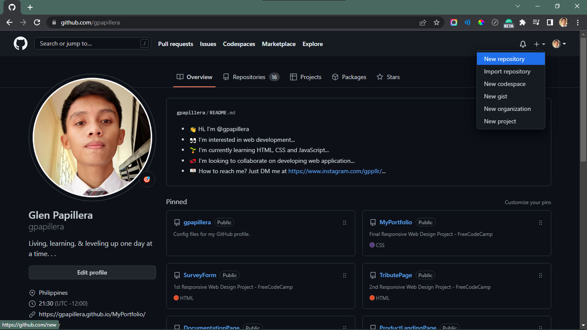
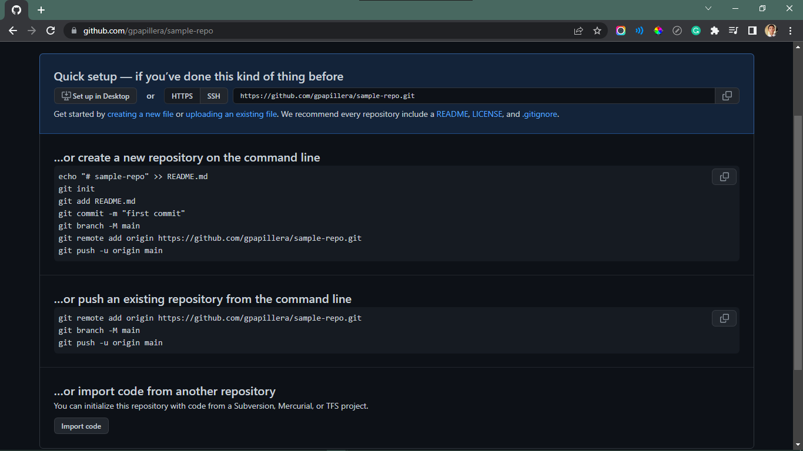

# 👨🏼‍💻 Git Commands 


## ⚙ Prerequisites

📌Go to this site 🌐[git](https://www.git-scm.com/). Then download and install `git` to your PC.\
📌A [GitHub](https://github.com/signup) account. 😎

<br>

## 💻 Starting with Git

1. 1st specify the **name**.
   ```Git
   git config --global user.name "Gln Papillers"
   ```
   >Hit ENTER.↩
2. Specify your **email address**.
    ```Git
    git config --global user.email "glnppllr@tiktokerist.com"
    ```
3. Set a **default *branch name***.
   ```Git
    git config --global init.default branch main 
   ```
   > `main` is the set default **branch name** for your git.

<br>

## 💻 Configure Git

1. **Help information** about `git config`. 
    ```Git
    git config -h
    ```
2. Detailed **Help information** about `git config`. 
    ```Git
    git help config
    ```

<br>

## 💻 Clear the Terminal
To have a fresh look of the terminal   
```Git
clear
```

<br>

## 💻 Ignore a File/Folder/Entensions

1. Open **file explorer**/**Folder** 📁 where your project is.
2. Create a text document - `*.txt` file. Just open **Notepad**. 📄
3. Rename the  `*.txt` file to `.gitignore`, hit **Yes**.
4. Open `.gitignore` with text editor, **Notepad**.
5. To **Add comment**, type `#` hit space then type the message.
   ```Git
   i.e.
   # ignore ALL .txt files
   ```
6. Lastly type a command to ingnore file/folder/extension
   ```Git
   i.e.
   # ignore ALL .txt files
   *.txt 
   ```
   > `*.txt` - command ignore all text files.

To see different ways on **ignoring a file** go with [gitignore](https://github.com/github/gitignore).

<br>

## 💻 Work with Git

1. Change directory to working folder
   ```Git
    cd c:/users/glenp/desktop/FolderName
   ```

2. **Initialize git** repository
   ```Git
    git init
   ```
   - Get repo **status**
     ```
     git status
     ```

3. **Stage** or **track** a file.
   ```Git
    git add index.html
   ```
   > `index.html` - file name and extension.
   - Command options to **track ALL files**, just *choose one*.
     ```
     git add --all
     git add -A
     git add .
     ```
    - **Unstage** or **untrack** a file.
        ```Git
        git rm --cached fileName.extension   
        ```
        OR remove file from staging, when not ready to commit
        ```Git
        git restore --staged fileName.extension   
        ```

4. **Commit Repository**.
    ```Git
    git commit -m "My 1st Commit"  
    ```
    - To see what's been **modified**.
    ```Git
    git diff 
    ```

5. **Bypass/skip over** staging 
   ```Git
    git commit -a -m "My Comment"
   ```

6. **Delete** a file.
   ```Git
    git rm "fileName.extension"
   ```
   > Easyway: Just delete the file in the folder.
   - **Restore** a deleted file.
    ```Git
    git restore "fileName.extension"
    ```

7. **Rename** a file.
   ```Git
    git mv "oldFileName.extnsn" "newFileName.extnsn"
   ```

8. **Review** the commit you made.
   ```Git
    git log
   ```
   - Review commit in **one line**.
    ```Git
    git log --oneline
    ```
9. **Amend change** with your latest commit.
    ```Git
    git commit -m "Your Comment" --amend
    ```
> To go back with your previous command, press `Arrow Up` ⬆

10. See **actual change** in every different commits/ **dig deep and specific**.
    ```Git
    git log -p
    ```
    - Exit view from `git log p` **press `q`**.

11. **Jump back** with the **previous commit**.
    ```Git
    git reset C193894
    ```
    > `C193894` - this is a commit address through accessing `git log`.

12. **Modify log history** of commits/the order in which all commits appear.
    ```Git
    git rebase -i --root
    ```
    - Go back to **default view**, press colon key and x `:x`.

<br>

## 💻 New Branch

1. **Create** a **new branch**.
   ```Git
    git branch newBranchName
   ```
   > `newBranchName` - set your own branch name.
   - **Switch branch**.
     ```Git
     git switch branchName
     ```
   - **Merge branch** with comment.
     ```Git
     git merge -m "yourComment" branchName
     ``` 
   > You can merge branches without comment by `git merge branchName`
   - **Delete branch**.
     ```Git
     git branch -d branchName
     ```
2. **Switch** and *at the same time* **create new branch**.
   ```Git
    git switch -c newBranchName
   ```
<br>

## 💻 Push Local Repository to Github

1. First you need to have [GitHub](https://github.com/signup) account.
2. Create **new repository** with GitHub.
   
   

    > Give new repository a name then click `Create repository`.

3. Newly created repository on Github looks like this:



4. **Add remote link** to a local repository. Copy `git remote` command then go back to your **terminal**, then paste.
   > In my case my **git remote command** looks like this:
   ```Git
    git remote add origin https://github.com/gpapillera/sample-repo.git
   ```
   > You have yours.

5. **Set** the **target branch**.
   ```Git
    git branch -M main
   ```

6. **Push all repository** to the cloud.
   ```Git
    git push -u origin main
   ```
   - **Push all branches**.
     ```Git
      git push --all
     ```
<br>

## 💻 Pull Github Repository (cloud) to Local Workspace

1. **1st option** on pulling GitHub Repository.
   - **Fetch** repository
      ```
       git fetch
      ```
      > GitHub repository will be fetch then place to your local computer.
   - **Merge** GitHub repo to local repo.
      ```Git
       git merge
      ```
      > GitHub repo will be merge (over write) to local repo.
2. **2nd option** on pulling GitHub Repository.
    ```Git
     git pull
    ```
    > This `git pull` command will directly `fetch` and `merge` GitHub repo to local repo.

<br>

## 💻 Deleting Branches

1. **Delete all branches except master/main**. (Local repo)
   ```Git
    git branch | grep -v "master/main" | xargs git branch -D
   ```
    OR
   ```Git
    git branch | grep -v " master$" | xargs git branch -D
   ```

2. **Delete branch remotely**.
   ```Git
    git branch -r --merged master/main | ack -v master/main | sed -e 's/\// :/' | xargs -n2 git push
   ```
   > choose between `master` or `main`.

### 🔗 Reference Links

[](https://youtu.be/tRZGeaHPoaw) 